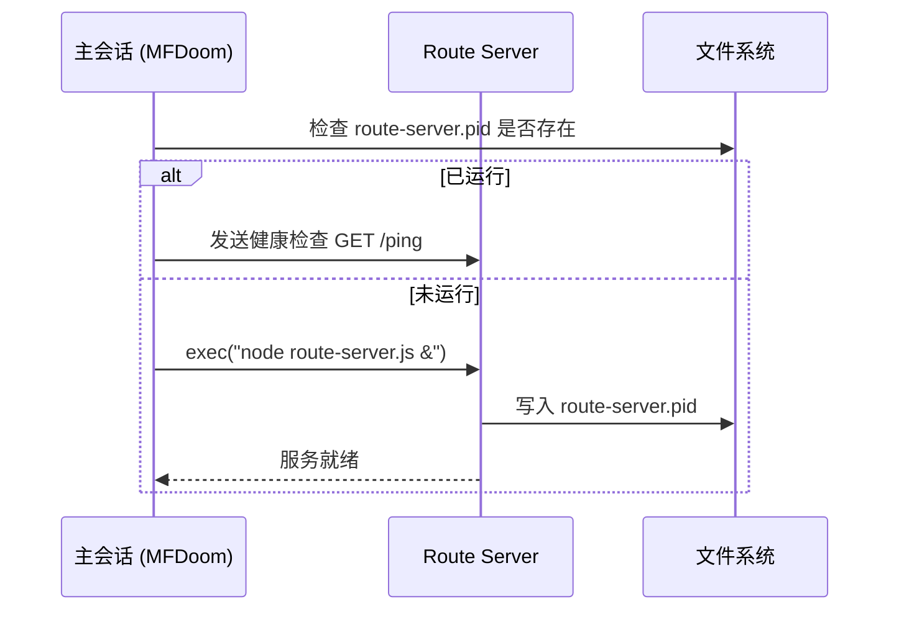
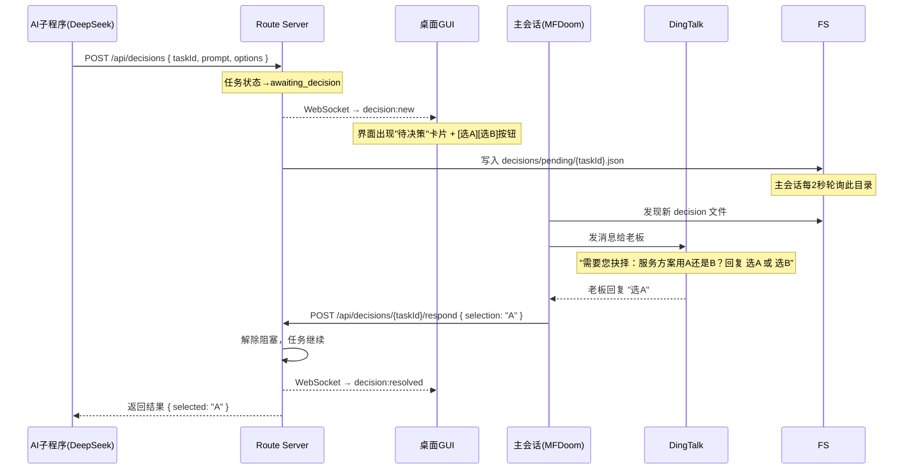
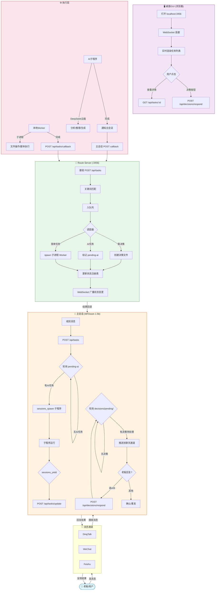
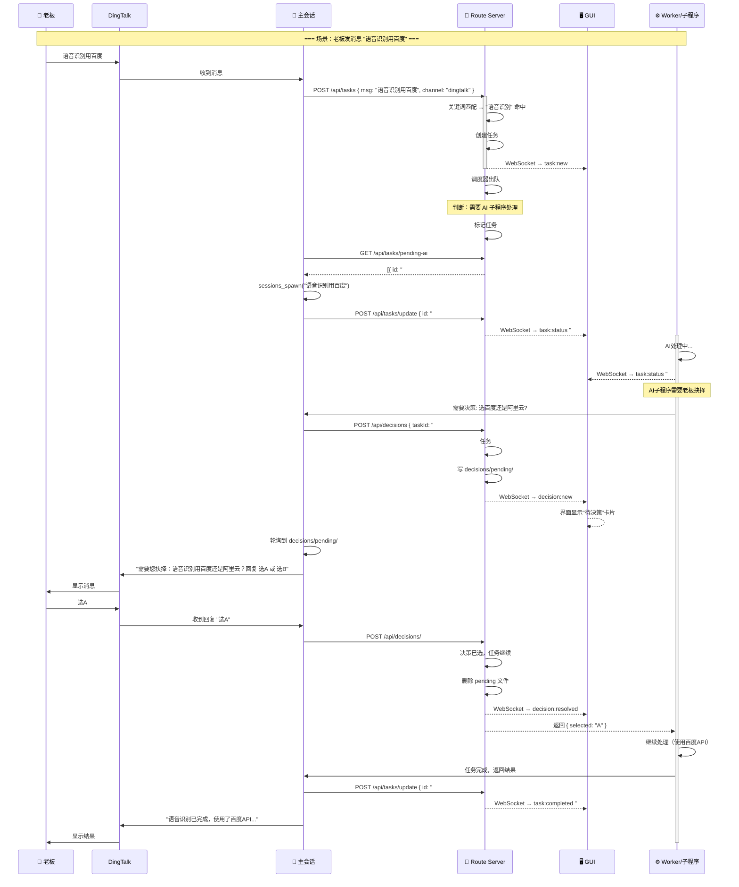

# 任务路由系统设计方案

> 设计日期：2026-06-01
> 目标：常驻路由子程序 + 桌面 GUI + 决策推送

---

## 整体架构概览

```
┌─────────────────────────────────────────────────────────┐
│                   Windows 11 宿主机                      │
│                                                         │
│  ┌──────────────┐    HTTP    ┌──────────────────────┐   │
│  │ 主会话 (MFD) │ ────────→  │  Route Server (:3456) │   │
│  │ (只做分拣)   │ ←────────  │  (常驻 Node.js 进程)  │   │
│  └──────────────┘  callback  │                       │   │
│                              │  ┌─────────────────┐  │   │
│                              │  │ 任务队列 (优先权) │  │   │
│                              │  └─────────────────┘  │   │
│  ┌──────────────┐            │  ┌─────────────────┐  │   │
│  │ 子程序 A     │ sessions   │  │ 状态注册表       │  │   │
│  │ (DeepSeek)   │ spawn/yield│  │ (内存+JSON持久)  │  │   │
│  └──────────────┘            │  └─────────────────┘  │   │
│                              │  ┌─────────────────┐  │   │
│  ┌──────────────┐            │  │ 决策管理器       │  │   │
│  │ 子程序 B     │            │  │ (等待用户抉择)   │  │   │
│  │ (DeepSeek)   │            │  └─────────────────┘  │   │
│  └──────────────┘            └──────────────────────┘   │
│                                          │              │
│                               WebSocket  │  REST API    │
│                                          ▼              │
│                              ┌──────────────────────┐   │
│                              │  桌面 GUI（浏览器)     │   │
│                              │  HTML/JS/CSS SPA     │   │
│                              │  打开 http://localhost│   │
│                              │  :3456/dashboard     │   │
│                              └──────────────────────┘   │
│                                          │              │
│                              ┌──────────────────────┐   │
│                              │  决策推送文件         │   │
│                              │  decisions/pending/   │   │
│                              └──────┬───────────────┘   │
│                                     │                   │
│                                     ▼                   │
│                              ┌──────────────────────┐   │
│                              │  主会话发送到         │   │
│                              │  DingTalk/微信/飞书   │   │
│                              └──────────────────────┘   │
└─────────────────────────────────────────────────────────┘
```

---

## 阶段一：路由子程序（Route Server）

### 核心设计

**技术选型**：单进程 Node.js HTTP 服务（零外部依赖，仅用 `http`, `fs`, `path`, `crypto`, `events` 内置模块）

**为什么不用 OpenClaw 子会话做路由？**
- OpenClaw 的 `sessions_spawn` 创建的子会话是**临时的**，会随任务完成而结束
- 路由需要**常驻**，需要在主会话生命周期之外独立运行
- 所以路由作为独立 Node.js 进程启动，通过 HTTP + 文件协议与主会话通信

### 启动方式



主会话启动时（或首次需要路由时）检查 PID 文件，不存在则启动。每次重启 Gateway 后自动重生。

### 消息接收机制

Route Server 暴露 HTTP API，主会话通过 HTTP 调用，子程序通过回调机制报告状态。

**为什么不走文件 IPC？**
- 文件读写有锁竞争风险，轮询延迟高
- HTTP 是无锁的，localhost 延迟 < 1ms
- 可以自然支持 WebSocket（GUI 实时刷新需要）

**为什么不走 stdin/stdout 管道？**
- 管道只能被一个进程持有，Route Server 需要同时与主会话、GUI、子程序通信
- 进程意外退出时管道断裂，HTTP 可优雅重试

### 任务流转设计

```
主会话收到消息
    │
    ▼
POST /api/tasks  { message, channel, user, context }
    │
    ▼
Route Server:
    ├──① 分词 + 关键词匹配（复用现有 route-task.js 算法）
    ├──② 创建任务记录 { id, name, status, created, priority }
    ├──③ 入队列（按优先级排序）
    │
    ▼
调度器（内部循环，每秒跑一次）:
    ├──④ 出队
    ├──⑤ 执行策略判断：
    │   ├── 简单任务（查文件/改配置）→ 直接 spawn 子进程 worker
    │   ├── AI 任务 → 回调主会话："请创建子程序处理任务 #{id}"
    │   └── 需要抉择 → 状态改为 awaiting_decision
    │
    ▼
    └──⑥ 更新状态注册表
```

### 状态注册表（内存 + 持久化）

```javascript
// 内存数据结构
{
  tasks: Map<taskId, {
    id: string,           // uuid
    name: string,         // 任务名称
    description: string,  // 用户原始消息
    status: 'queued' | 'running' | 'awaiting_decision' | 'completed' | 'failed',
    priority: 0-10,
    channel: string,      // 来源通道 (dingtalk/wechat/feishu)
    subagentInfo: {       // 如果是 AI 任务，记录子程序信息
      sessionKey: string | null,
      startedAt: string,
      completedAt: string | null
    },
    decisionRequest: {    // 如果需要决策
      prompt: string,
      options: [{ key, label }],
      selected: string | null
    },
    result: any,
    errors: string[],
    createdAt: string,
    updatedAt: string
  }>,
  queue: PriorityQueue<taskId>,
  workers: Map<workerPid, { taskId, status, startedAt }>
}
```

每 30 秒自动快照到 `data/task-registry.json`，服务重启时恢复。

### 管理已创建的执行子程序

子程序分为两类，路由用不同方式管理：

| 类型 | 管理方式 | 如何跟踪状态 |
|------|---------|------------|
| **本地 Worker**（Node.js 子进程） | `child_process.fork()`，直接父子通信 | `worker.on('message')` 接收状态更新 |
| **AI 子程序**（OpenClaw sessions_spawn） | 通过主会话间接管理 | 主会话通过 `POST /api/tasks/:id/callback` 报告子程序完成 |

**关键设计决策**：Route Server 不直接调用 `sessions_spawn`（因为没有 OpenClaw API），而是：
1. 主会话轮询 `GET /api/tasks/pending-ai`（每 2 秒）
2. 发现有需要 AI 处理的任务 → 创建子程序 → 完成后 `POST /api/tasks/:id/update`
3. 这样既保留了 OpenClaw 的子会话机制，又让路由统一管理状态

### 队列优先级策略

```
高优先级（priority 8-10）：老板直接提的需求、紧急故障
中优先级（priority 4-7）：常规任务、信息查询
低优先级（priority 1-3）：系统维护、知识沉淀、离线分析
```

---

## 阶段二：桌面 GUI

### 推荐方案：**方案 D — Web 技术（HTML/JS/CSS + HTTP Server）**

**推荐理由**（对比其他方案）：

| 方案 | 优点 | 缺点 | 评分 |
|------|------|------|:----:|
| 🅰 **Electron** | 原生窗口感 | 200MB+ 安装包、高内存(~200MB) | ❌ |
| 🅱 **HTTP + 浏览器** | 零安装、轻量(< 5MB)、热更新 | 需要开浏览器标签 | ✅ **推荐** |
| 🅲 **PowerShell WinForms** | 最轻量(< 1MB) | 开发效率低、样式丑、难维护 | ⚠️ 备选 |
| 🅳 **Node.js HTTP Server** | 共享路由端口、WebSocket天然支持 | 浏览器安全问题（localhost 无风险） | ✅ **最佳** |

**为什么不选 Electron？**
- GTX 960 只有 4GB 显存，Electron 每个窗口吃 150-200MB RAM
- 16GB 系统 RAM 够用但没必要浪费
- 浏览器已经是最成熟的渲染平台

**为什么不选 PowerShell WinForms？**
- 异步支持差，要做 WebSocket 实时更新非常复杂
- 样式全靠 Win32 API 手绘，开发时间翻 3 倍
- 维护困难，老板以后想加功能你得重新编译

**方案 D 的实操方式**：
- Route Server 内置一个 `http.createServer()`，在同一个端口（:3456）提供 REST API + 静态文件
- GUI 是一个单页 HTML 文件（`dashboard.html`），放在 `public/` 目录
- 打开 `http://localhost:3456/dashboard` 即可使用
- WebSocket 实现实时推送（路由状态变更时自动推送到浏览器）

### GUI 界面布局

```
┌─────────────────────────────────────────────────────────┐
│  🎯 任务路由控制面板                 2026-06-01 14:32   │
│  ┌─────────────────────────────────────────────────────┐ │
│  │  统计数据条:                                        │ │
│  │  [排队: 2]  [运行中: 3]  [已完成: 47]  [失败: 1]   │ │
│  └─────────────────────────────────────────────────────┘ │
│                                                         │
│  ┌─────────────┐  ┌─────────────┐  ┌─────────────┐     │
│  │ 📌 等待决策  │  │ ▶ 运行中    │  │ ⏳ 队列中    │     │
│  │  ┌─────────┐│  │  ┌─────────┐│  │  ┌─────────┐│     │
│  │  │选服务方案││  │  │语音识别 ││  │  │周报生成 ││     │
│  │  │ 12:30 🟡 ││  │  │ 已运行2m││  │  │ 优先级3 ││     │
│  │  │ [选A][选B]││  │  │ 进度:80%││  │  └─────────┘│     │
│  │  └─────────┘│  │  └─────────┘│  │  ┌─────────┐│     │
│  │              │  │  ┌─────────┐│  │  │翻译文档 ││     │
│  │              │  │  │百度ASR  ││  │  │ 优先级1 ││     │
│  │              │  │  │ 已运行5m││  │  └─────────┘│     │
│  │              │  │  └─────────┘│  │              │     │
│  └─────────────┘  └─────────────┘  └─────────────┘     │
│                                                         │
│  ┌─────────────────────────────────────────────────────┐ │
│  │ 📋 任务详情 (点击任意任务展开)                       │ │
│  │  ─────────────────────────────────────────────       │ │
│  │  任务ID: abc-123                                    │ │
│  │  消息: "帮我把这份PDF转成Word"                       │ │
│  │  来源: 钉钉 | 状态: ✅ 已完成 | 耗时: 23秒           │ │
│  │  结果: output.docx (2.3MB)                           │ │
│  │  ─────────────────────────────────────────────       │ │
│  │  任务ID: def-456                                    │ │
│  │  消息: "语音识别用百度"                              │ │
│  │  来源: 微信 | 状态: ▶ 运行中 | 已运行: 2分15秒       │ │
│  └─────────────────────────────────────────────────────┘ │
│                                                         │
│  ⚙️ [系统日志] [配置] [重启路由]                        │
└─────────────────────────────────────────────────────────┘
```

### 关键技术细节

**实时更新机制**：WebSocket（Server-Sent Events 降级方案）
- Route Server 提供 `/ws` 端点
- 事件类型：`task:new` / `task:status` / `task:completed` / `task:failed` / `decision:new`
- GUI 收到事件后局部刷新 DOM，不做全页刷新

**自启动**：

```powershell
# 方案 A（推荐）：开机自启 + 常驻
$routeCmd = "node C:\path\to\route-server.js"
$trigger = New-JobTrigger -AtStartup -RandomDelay 00:00:30
Register-ScheduledJob -Name "TaskRouteServer" -ScriptBlock { $using:routeCmd } -Trigger $trigger

# 方案 B：双击启动图标
# 创建一个 route-server.cmd 快捷方式放在启动文件夹
```

**浏览器自动打开**：
- Route Server 启动后自动尝试打开 `http://localhost:3456/dashboard`
- 使用 `child_process.exec('start http://localhost:3456/dashboard')`

---

## 阶段三：决策推送

### 完整设计

决策推送涉及三个组件协作：



### 决策文件协议

```json
// decisions/pending/{taskId}.json
{
  "taskId": "abc-123",
  "prompt": "需要您抉择：服务方案用A还是B？",
  "options": [
    { "key": "A", "label": "方案A：用百度语音识别（免费，准确率95%）" },
    { "key": "B", "label": "方案B：用阿里云语音识别（付费，准确率98%）" }
  ],
  "status": "pending",
  "expiresAt": "2026-06-01T15:00:00.000Z"
}

// 老板回复后：
// decisions/pending/{taskId}.json → decisions/resolved/{taskId}.json
{
  "taskId": "abc-123",
  "status": "resolved",
  "selected": "A",
  "respondedBy": "dingtalk",
  "respondedAt": "2026-06-01T14:35:00.000Z"
}
```

### 推送通道策略

```
老板决策时，按优先级依次尝试：
  ① DingTalk（主要通道，日常使用）
     → 主会话调用 DingTalk API 发送带决策信息的消息
     → 老板回复 → 主会话解析 → 回写决策文件
  
  ② WeChat（备用通道，如果 DingTalk 不在线）
     → 同样机制
  
  ③ Feishu（三线通道）
  
  ④ GUI 直接点击（桌面在眼前时最快捷）
     → 点击 [选A] 按钮 → AJAX POST /api/decisions/{id}/respond
     → 立即生效，无需等待聊天回复
```

### 聊天回复解析机制

老板在 DingTalk 回复 "选A" 或 "选B" → 主会话收到消息后：

1. 搜索 `decisions/pending/` 目录是否有等待决策的任务
2. 如果有多个 → 取最新的
3. 解析回复：
   - 匹配正则 `/选([A-Z\d])/` 或 `/选项([A-Z\d])/`
   - 找到对应 option key
4. `POST /api/decisions/{taskId}/respond { selection }`
5. 删除 pending 文件，移动到 resolved

**多决策并发场景**：按 taskId 严格对应，每个决策文件独立。老板回复时可带任务描述来消除歧义：
- 老板说 "方案用A" → 匹配最新 waiting 的决策
- 老板说 "语音识别选A" → 匹配描述包含"语音识别"的决策
- 老板说 "task-abc 选A" → 精确匹配 taskId

---

## 阶段四：完整消息流转图

### Mermaid 流程图（主图）



### 时序图：完整消息流转



---

## Route Server 接口设计（完整）

### REST API

| 方法 | 路径 | 用途 | 主会话调用 | GUI调用 | Worker调用 |
|:----:|:----|:----|:---------:|:-------:|:---------:|
| GET | `/ping` | 健康检查 | ✅ | - | - |
| POST | `/api/tasks` | 提交新任务 | ✅ | - | - |
| GET | `/api/tasks` | 列出所有任务 | - | ✅ | - |
| GET | `/api/tasks/:id` | 任务详情 | - | ✅ | - |
| GET | `/api/tasks/pending-ai` | 获取待AI处理 | ✅ | - | - |
| POST | `/api/tasks/:id/update` | 更新任务状态 | ✅ | - | ✅ |
| POST | `/api/tasks/:id/callback` | 任务完成回调 | ✅ | - | ✅ |
| POST | `/api/decisions` | 提交决策请求 | ✅ | - | ✅ |
| GET | `/api/decisions/pending` | 获取待处理决策 | ✅ | - | - |
| POST | `/api/decisions/:id/respond` | 响应决策 | ✅ | ✅ | - |
| GET | `/api/stats` | 统计数据 | - | ✅ | - |

### WebSocket 事件

| 事件名 | 负载 | 触发条件 |
|:-------|:-----|:---------|
| `task:new` | `{ id, name, channel, priority }` | 新任务入队 |
| `task:status` | `{ id, status, progress? }` | 状态变更 |
| `task:completed` | `{ id, result, duration }` | 任务完成 |
| `task:failed` | `{ id, errors }` | 任务失败 |
| `decision:new` | `{ taskId, prompt, options }` | 新决策请求 |
| `decision:resolved` | `{ taskId, selected }` | 决策已响应 |
| `server:health` | `{ uptime, queueLength, workers }` | 每 30 秒心跳 |

---

## 文件结构

```
workspace/
├── route-server.js          # 主路由服务（HTTP + WebSocket + 调度器）
├── route-task.js            # 关键词匹配（已有，复用）
├── lib/
│   ├── task-queue.js        # 优先队列实现
│   ├── task-registry.js     # 任务注册表（内存 + 持久化）
│   ├── decision-manager.js  # 决策管理器
│   ├── scheduler.js         # 调度器循环
│   ├── websocket.js         # WebSocket 服务
│   └── worker-manager.js    # 本地 Worker 管理
├── public/
│   ├── dashboard.html       # 主面板
│   ├── dashboard.css        # 样式
│   └── dashboard.js         # GUI 逻辑（WebSocket 客户端 + AJAX）
├── data/
│   └── task-registry.json   # 持久化快照
├── decisions/
│   ├── pending/             # 待处理的决策请求
│   └── resolved/            # 已处理的决策（归档）
└── logs/
    └── route-server.log     # 运行日志
```

---

## 技术风险与缓解

### 1. 进程崩溃恢复
- **风险**：Route Server 意外退出，队列中的任务丢失
- **缓解**：
  - 状态注册表每 30 秒快照到磁盘
  - 重启时从 `data/task-registry.json` 恢复（running 状态重置为 queued）
  - 主会话定时（每 30 秒）健康检查，发现路由挂了就重启
  - 使用 `process.on('uncaughtException')` 和 `process.on('unhandledRejection')` 兜底

### 2. 死锁 / 队列堆积
- **风险**：Worker 卡住不返回，队列越来越长
- **缓解**：
  - 每个任务有超时时间（简单任务 60s，AI 任务 300s）
  - 超时后标记为 failed 并通知老板
  - 队列最大长度 1000，超过则拒绝新任务
  - Worker 管理器监控子进程，僵尸进程自动 kill

### 3. 主会话挂掉
- **风险**：主会话崩溃，Route Server 的 pending-ai 任务无人认领
- **缓解**：
  - Route Server 记录每个 pending-ai 任务的创建时间
  - 超过 30 秒无人认领的，标记为 timeout 并尝试降级为本地 worker 处理
  - 本地优先：简单任务（文件操作/脚本执行）直接本地 worker 处理，不依赖 AI 子程序

### 4. 端口冲突
- **风险**：3456 端口被占用
- **缓解**：
  - 启动时检测端口可用性，被占则自动 +1 重试（最多 5 次）
  - 写 `data/port.txt` 记录实际端口
  - 自动打开的 dashboard 链接用实际端口

---

## 实施顺序

| 阶段 | 内容 | 预估工时 | 前置依赖 |
|:----:|:-----|:--------:|:---------|
| **1a** | Route Server 骨架：HTTP 服务 + 队列 + 状态注册表 | 1天 | 无 |
| **1b** | 关键词匹配集成 + pending-ai 回调 | 0.5天 | 1a |
| **1c** | Worker 管理（本地子进程） | 1天 | 1a |
| **2a** | GUI 静态页面 + REST API 集成 | 1天 | 1a |
| **2b** | WebSocket 实时更新 | 0.5天 | 2a |
| **2c** | 自启动 + 开机自动打开浏览器 | 0.5天 | 2a |
| **3a** | 决策管理器 + 文件协议 | 0.5天 | 1a |
| **3b** | 主会话决策轮询 + 聊天回复解析 | 0.5天 | 3a |
| **4** | 集成测试 + 日志 + 异常处理 | 1天 | 全部 |
| **合计** | | **~6.5天** | |

---

## 总结

| 组件 | 技术选型 | 核心优势 |
|:-----|:---------|:---------|
| **路由服务** | Node.js HTTP + WebSocket | 零外部依赖，与现有架构兼容，支持实时推送 |
| **桌面GUI** | 浏览器 HTML/JS/CSS SPA | 不计入内存占用的方案，热更新，开发效率高 |
| **决策推送** | 文件协议 + DingTalk API | 解耦路由与消息通道，老板可在任何通道回复 |
| **进程管理** | PID 文件 + 健康检查 | Gateway 重启后自动重生，崩溃自恢复 |
| **数据持久** | JSON 快照 | 零依赖，重启可恢复，可用 Git 追踪历史 |

整个系统只有 Node.js 内置模块，**零 npm 依赖**。保持轻量、可维护、易扩展。
