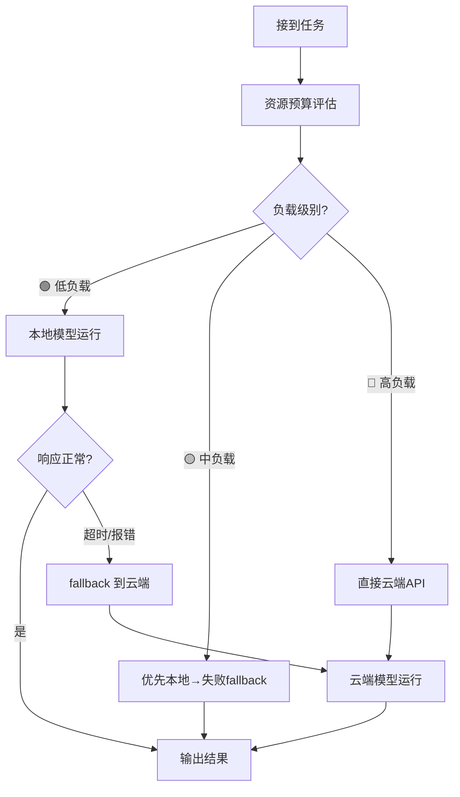

# Model Resource Budget — 智能模型分层调度

## 概述

本技能让 AI Agent 在接到任务时，自动完成两步判断：

1. **资源预算**：读取宿主机 GPU 显存、CPU 核心数、可用内存，判断本地模型能否流畅运行
2. **模型选型**：根据任务类型和资源预算结果，自动选用本地免费模型或云端付费模型

目标是：**轻量任务本地跑（免费），复杂任务云端跑（省心），电脑不卡，钱包不痛。**

---

## 工作流程

### Step 1：读取宿主机硬件配置

运行 `scripts/detect-hardware.sh`（Linux/macOS）或 `scripts/detect-hardware.ps1`（Windows），自动获取：

| 参数 | 说明 | 判断依据 |
|------|------|----------|
| GPU 显存总量 | 影响能跑多大的模型 | < 4GB → 只能用 ≤1.5B 模型 |
| 可用显存 | 当前空闲量 | < 2GB → 本地模型大概率失败 |
| CPU 核心数 | 模型回退 CPU 推理时的并行能力 | < 4 核 → CPU 推理极慢 |
| 系统可用内存 | 模型加载 + KV Cache + 系统开销 | < 8GB → 本地模型容易卡死 |

### Step 2：任务复杂度评估

按照以下维度对收到的任务做**资源预算**：

| 预算级别 | 判断标准 | 推荐模型 |
|---------|---------|---------|
| 🟢 **低负载** | 闲聊、查配置、读短文件、简单问答；**且**本轮对话 < 10 条消息 | 本地模型（ollama/llama.cpp 等） |
| 🟡 **中负载** | 写少量代码、翻译、整理中等数据；**或**对话 10-30 条消息 | 尝试本地 → 超时/报错 fallback 云端 |
| 🔴 **高负载** | **以下任一满足即走云端**：
  1. 多文件处理、大文档分析、批量任务、联网搜索、工具调用
  2. **对话历史 ≥ 30 条消息**（本地 1.5B 模型上下文仅 4K，超标必崩）
  3. 需要图片/文档识别（显存不够）
  4. 当前会话已经发生过一次本地模型失败

### 🚦 主动新建会话规则

当检测到以下情况时，**主动用 `sessions_spawn` 创建新会话来继续任务**，避免上下文溢出：

| 条件 | 动作 |
|------|------|
| 当前会话已发生 context-overflow | spawn 新会话，传递上下文摘要继续 |
| 对话消息数 ≥ 30 条且本地模型上次已 fail | spawn 新会话，仅传关键上下文 |
| MEMORY.md 或 key context 文件已被完整读取过 | spawn 新会话，仅传需求摘要 |

**本地模型各模型的上下文窗口上限供参考：**

| 模型 | 窗口大小 | 安全线（80%） |
|------|---------|--------------|
| deepseek-r1:1.5b | 4,096 tokens | ~10 条消息 |
| qwen2.5:1.5b | 32,768 tokens | ~60 条消息 |
| qwen2.5-coder:3b | 32,768 tokens | ~60 条消息 |

> 实际 token 数取决于消息长度，以上为参考值。

### Step 3：模型路由



---

## 硬件兼容性速查

### 典型 GPU 配置推荐

| GPU | 显存 | 可本地运行的模型 | 最大上下文 |
|-----|------|-----------------|-----------|
| GTX 960 / 1050 Ti | 4 GB | ≤1.5B（如 deepseek-r1:1.5b, qwen2.5:1.5b） | 8K-16K |
| GTX 1060 / 1650 | 6 GB | ≤3B（如 qwen2.5:3b） | 8K-16K |
| RTX 3060 / 4060 | 12 GB | ≤8B（如 llama3.1:8b, qwen2.5:7b） | 32K |
| RTX 4090 | 24 GB | ≤70B（可量化运行） | 128K |
| 无 GPU / 核显 | 0 GB（系统内存） | ≤1.5B（纯 CPU，极慢） | 4K-8K |

### 本地 vs 云端模型选择参考

| 维度 | 本地模型（1.5B） | 云端模型（DeepSeek/GPT） |
|------|-----------------|------------------------|
| 费用 | 免费 | 按 token 计费 |
| 响应速度 | 0.5-3秒（GPU）/ 5-15秒（CPU） | 1-5秒（视网络） |
| 推理能力 | 基础问答、简单分类 | 复杂推理、代码、创意 |
| 工具调用 | 弱（1.5B 不支持复杂工具） | 强（原生支持） |
| 隐私 | 数据不出本地 | 数据上传云端 |

---

## 安装

```bash
# 通过 skillhub 安装
npx skillhub install your-username/model-resource-budget

# 或克隆仓库
git clone https://github.com/your-username/model-resource-budget.git
# 将 skills/model-resource-budget 复制到你的 workspace/skills/ 目录
```

## 依赖

- 硬件检测脚本：`nvidia-smi`（NVIDIA GPU）、`lshw`（Linux）、`wmic`（Windows）
- 本地模型运行：Ollama / llama.cpp / 任何兼容 OpenAI API 的本地推理引擎
- 云端模型：DeepSeek / OpenAI / Anthropic 等 API（需配置 API Key）

---

## 许可证

MIT — 自由使用、修改、分享。
